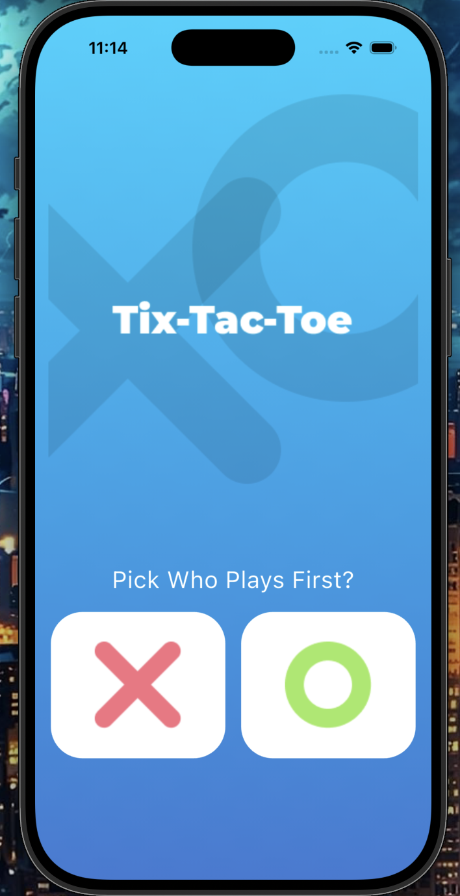
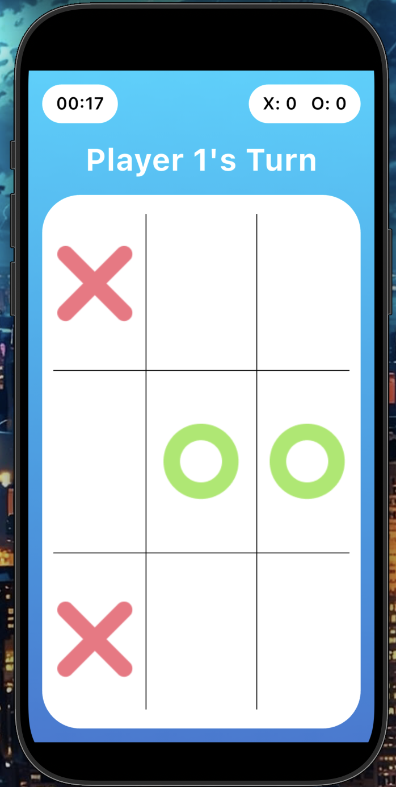
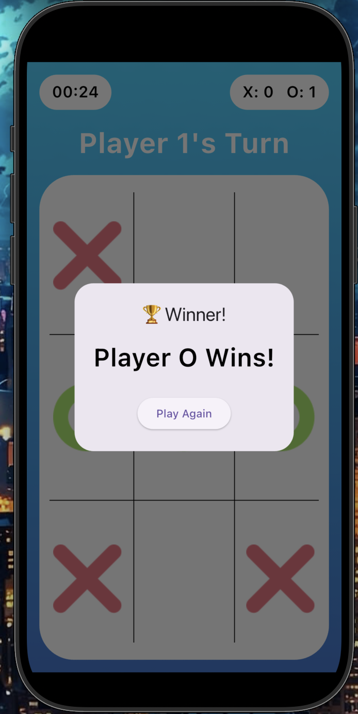
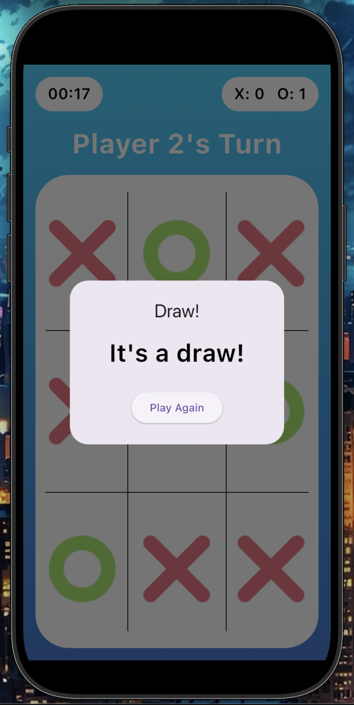

# XO Game

A Flutter Tic-Tac-Toe game with player selection, timer, score tracking, winner detection, and draw handling.

## Features

- Player selection
- Tic-Tac-Toe gameplay
- Winner detection
- Draw detection
- Game timer
- Win counter
- Play again

## Technologies

- Flutter
- Dart

## Project Structure

xo_game/
├── android/
├── assets/
├── ios/
├── lib/
├── linux/
├── macos/
├── test/
├── web/
├── windows/
├── .gitignore
├── .metadata
├── analysis_options.yaml
├── pubspec.yaml
├── pubspec.lock
└── README.md

## Getting Started

...

## Screenshots

  
  
  
  

## Author

Ahmed Salah
